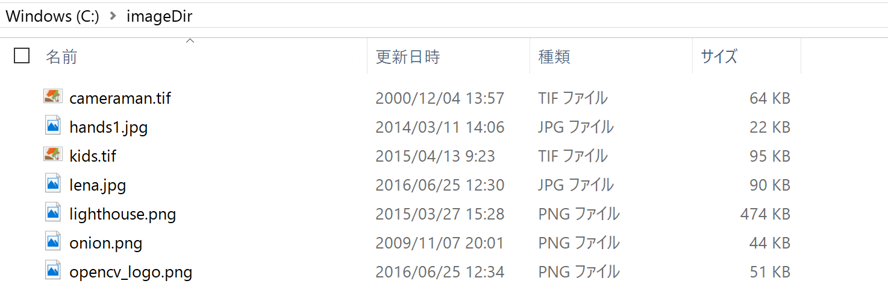
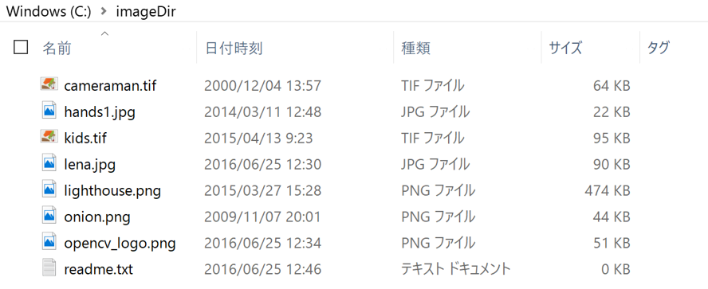

Pythonの標準ライブラリの利用
====

## ファイルシステム

### ディレクトリ内のファイルの列挙

Pythonのosモジュールを使うと，データを扱う実験で必要なディレクトリ操作も簡単に使えます．

例として，あるディレクトリにある画像ファイルを列挙してみましょう．

``` Python
import os

image_dir = "C:/imageDir"
image_files = os.listdir(image_dir)

print (image_files)
```

例えば，"C:/imageDir"が次のようになっている場合，



プログラムの出力は以下のようになります．

``` Python
['cameraman.tif', 'hands1.jpg', 'kids.tif', 'lena.jpg', 'lighthouse.png', 'onion.png', 'opencv_logo.png']
```

このプログラムの問題は，次のように画像ファイル以外の物が含まれていた場合，



そのファイルが一緒に出力されてしまうことです．

``` Python
['cameraman.tif', 'hands1.jpg', 'kids.tif', 'lena.jpg', 'lighthouse.png', 'onion.png', 'opencv_logo.png', 'readme.txt']
```

そこで，指定された拡張子のファイルのみ拾ってくるようにプログラムを改良しましょう．

``` Python
import os

# 画像ファイルを識別するための拡張子リスト
image_exts = [".tif", ".jpg", ".png"]

image_dir = "C:/imageDir"
dir_files = os.listdir(image_dir)

image_files = []

# image_extsの拡張子が含まれている場合，image_filesに追加．
for dir_file in dir_files:
    for image_ext in image_exts:
        if image_ext in dir_file:
            image_files.append(dir_file)

print (image_files)
```

上のように改良することで，'readme.txt'を検索対象からはじくことができます．
BMP画像等のファイルを検索対象に含めたければ，```image_exts```に```".bmp"```を追加すれば検索可能です．

### ディレクトリパスの指定方法

ディレクトリの指定方法についても色々工夫することができます．
例えば，現在プログラムを走らせているモジュールのファイルパスを取得して，
相対的にディレクトリを指定することも可能です．

``` Python
import os

module_file = os.path.abspath(__file__)
print ("     module file: ", module_file)

module_dir = os.path.dirname(module_file)
print ("module directory: ", module_dir)

image_dir = os.path.abspath(os.path.join(module_dir, "../images"))
print (" image directory:", image_dir)
```

例えば，Pythonスクリプトのファイルが```C:\GitHub\PyIntroduction\common\set_image_dir.py```にある場合，
出力は以下のようになります．

```
     module file:  C:\GitHub\PyIntroduction\common\set_image_dir.py
module directory:  C:\GitHub\PyIntroduction\common
 image directory:  C:\GitHub\PyIntroduction\images
```

### ファイルのコピー

ファイルのコピー操作には，shutilモジュールを使います．

``` Python
import shutil

shutil.copy2("C:/srcDir/src.txt", "C:/dstDir/dst.txt")
```

copy2関数では，更新時間やアクセス時間等，ファイルのメタデータも含めてコピーします．
shutil.copyとした場合には，ファイルはコピーされますがメタデータはコピーされません．

### ディレクトリのコピー

以下のようにサブディレクトリも含めて，丸ごとコピーできます．

``` Python
import shutil

shutil.copytree("C:/srcDir", "C:/dstDir")
```

## 時間計測

計算に時間が処理を行う場合，
処理時間を計測したいケースは結構あると思います．

``` Python
import time

start_time = time.time()

# 計算時間がかかる処理
for i in range(100000):
    print(i)

elapsed_time = time.time() - start_time
print ("elapsed time: %3f [sec]" % elapsed_time)
```

実験環境は，Surface Bookでそこそこ処理性能が良く，

``` Python
...
99996
99997
99998
99999
elapsed time: 0.538798 [sec]
```

0.5秒くらいの時間がかかっています．
実験環境によっては，処理に時間がかかるかもしれないので，
```range(100000)```の数を調整してみてください．