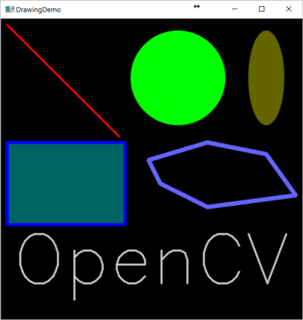

入出力とGUI: OpenCVの描画
====

OpenCVには，直線，四角形，円等基本的な図形の描画機能が備わっています．
よく使う関数群を下に列挙してみます．

* cv2.line: 直線の描画
* cv2.circle: 円の描画
* cv2.ellipse: 楕円の描画
* cv2.rectangle: 四角形の描画
* cv2.putText: テキストの描画

バージョンは少し古めですが，
[OpenCV 2.4 Drawing Functions](http://docs.opencv.org/2.4/modules/core/doc/drawing_functions.html)に
関数の引数の詳細がまとめられていますので，こちらも確認してみてください．

以下は，OpenCVの描画関数のサンプルコードです．

``` Python
import cv2
import numpy as np


# 描画用の空画像の作成
def emptyImage():
    img = np.zeros((512, 512, 3), np.uint8)
    return img

# 直線の描画
def drawLine(img, pt1, pt2, color, width):
    print(dir(cv2))
    img = cv2.line(img, pt1, pt2, color, width, cv2.LINE_AA)

# 円の描画
def drawCircle(img, center, radius, color, width):
    img = cv2.circle(img, center, radius, color, width, cv2.LINE_AA)

# 楕円の描画
def drawElipse(img, center, axes, angle, startAngle, endAngle, color, width):
    img = cv2.ellipse(img, center, axes, angle, startAngle, endAngle, color, width, cv2.LINE_AA)

# 四角形の描画
def drawRectangle(img, pt1, pt2, color, width):
    img = cv2.rectangle(img, pt1, pt2, color, width, cv2.LINE_AA)

# ポリゴンの描画
def drawPolylines(img, pts, isClosed, color, width):
    img = cv2.polylines(img, pts, isClosed, color, width, cv2.LINE_AA)


font_types = [cv2.FONT_HERSHEY_SIMPLEX, cv2.FONT_HERSHEY_PLAIN, cv2.FONT_HERSHEY_COMPLEX,
              cv2.FONT_HERSHEY_COMPLEX_SMALL, cv2.FONT_HERSHEY_DUPLEX,
              cv2.FONT_HERSHEY_SCRIPT_COMPLEX, cv2.FONT_HERSHEY_SCRIPT_SIMPLEX,
              cv2.FONT_HERSHEY_TRIPLEX, cv2.FONT_ITALIC]

# 文字の描画
def drawText(img, text, org, fontFace, fontScale, color, width):
    img = cv2.putText(img, text, org, fontFace, fontScale, color, width, cv2.LINE_AA)

def drawingDemo():
    img = emptyImage()

    # 太さ2の直線描画
    drawLine(img, (10, 10), (100, 100), (0, 0, 255), 2)

    # 太さに-1を指定すると，塗りつぶしになる
    drawCircle(img, (160, 60), 50, (0, 255, 0), -1)

    # 中と外を両方描画
    drawRectangle(img, (10, 110), (110, 210), (100, 100, 0), -1)
    drawRectangle(img, (10, 110), (110, 210), (255, 0, 0), 3)

    # 楕円の描画
    drawElipse(img, (300, 60), (50, 30), 0, 0, 360, (0, 100, 100), -1)

    # ポリゴンの描画
    pts = np.array([[(150, 140), (160, 180), (200, 220), (300, 200), (280, 130), (250, 110)]], dtype=np.int32)
    drawPolylines(img, pts, True, (255, 100, 100), 5)

    # テキストの描画
    drawText(img, 'OpenCV', (20, 350), font_types[0], 4, (200, 200, 200), 2)

    cv2.namedWindow('DrawingDemo', cv2.WINDOW_AUTOSIZE)
    cv2.imshow('DrawingDemo', img)
    cv2.waitKey(0)
    cv2.destroyAllWindows()

if __name__ == '__main__':
    drawingDemo()
```

プログラムを実行すると，以下のような描画結果が表れます．



基本的には，描画関数の引数をそのまま使っているだけですが，
変数名が入っているので少し分かりやすくなっていると思います．

まず，OpenCVの描画関数に関してですが，```uint8```型の画像で行う必要があります．
今回のデモ関数でも，まず，```emptyImage```関数で```uint8```型の空画像を作成しています．

描画関数の基本形は，```cv2.drawfunc(img, [shapeParams], color, width, line_type)```になっています．
例えば，```cv2.line```では，両端点の```pt1, pt2```を指定する形になっていて，```cv2.circle```では，円の中心と半径```center, radius```を指定する形になっています．

各draw関数の内部で```line_type```に線分の描き方の種類を指定しています．```cv2.LINE_AA```を指定すると，アンチエイリアス付きの線分描画になります．

描画関数のデモ```drawingDemo```関数中にもありますが，````width = -1```を指定すると，輪郭線描画ではなく，中を塗りつぶす描画に変わります．
